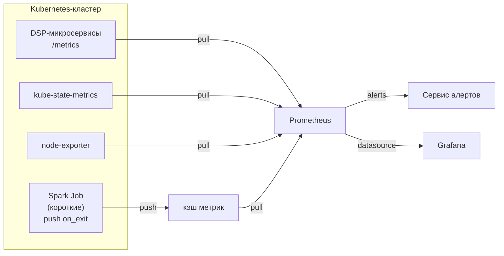
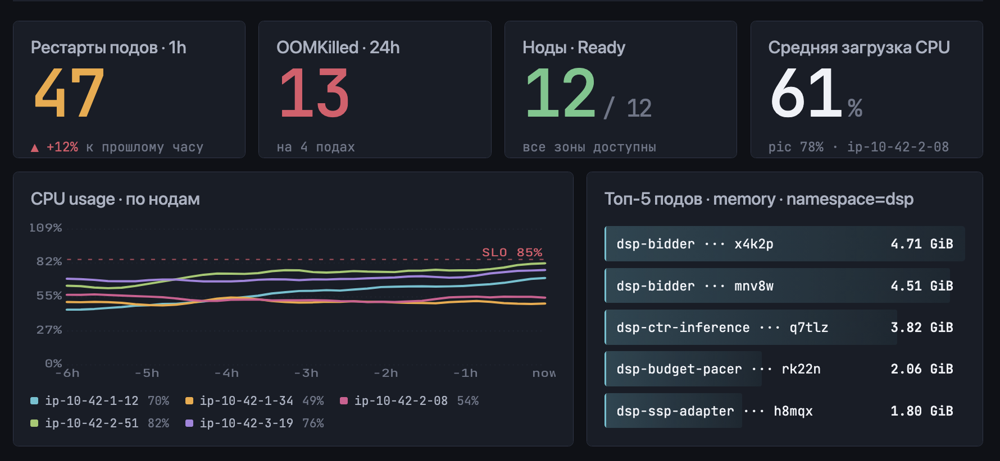
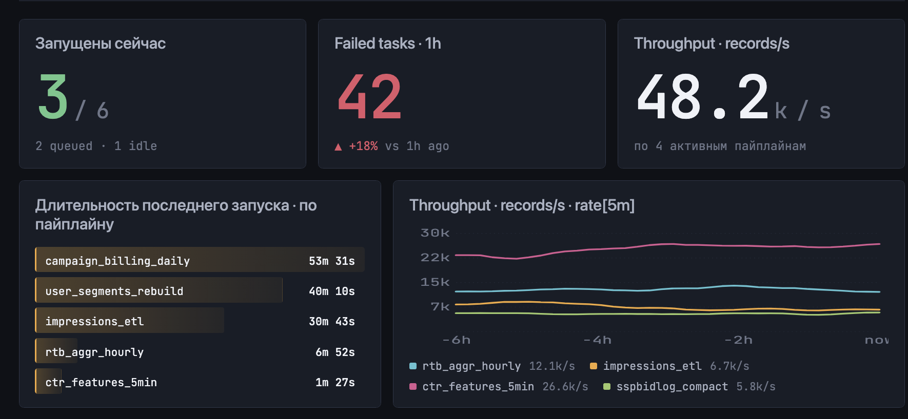
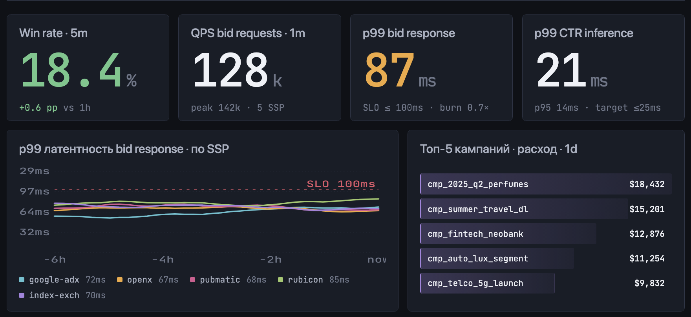

# ДЗ13: Мониторинг DSP-платформы на Prometheus + Grafana

Архитектурная документация системы мониторинга для DSP (Demand-Side Platform) в Kubernetes. В кластере крутятся долгоживущие микросервисы реального времени (обработка `bid request` со SLA <100ms, инференс CTR, биллинг кампаний) и Spark batch-джобы (агрегация логов показов, переобучение CTR-модели, реконсиляция).

---

## 1. Общая картина



---

## 2. Ключевые метрики

Метрики разделены на три группы: RTB-микросервисы, инференс CTR и Spark-пайплайны. Лейблы выбраны так, чтобы поддерживать срезы по бизнесу (SSP, кампания, страна)

### 2.1 RTB-микросервисы

| Метрика | Тип | Лейблы | Назначение |
|---|---|---|---|
| `dsp_bid_requests_total` | counter | `ssp`, `country`, `ad_format`, `device_type` | Входящий поток запросов от SSP |
| `dsp_bid_response_duration_seconds` | histogram | `ssp`, `decision` | Latency ответа, основа SLA |
| `dsp_wins_total` | counter | `campaign_id`, `advertiser_id`, `ssp` | Выигранные аукционы |
| `dsp_spend_dollars_total` | counter | `campaign_id`, `advertiser_id` | Потраченный бюджет |

### 2.2 Инференс CTR

| Метрика | Тип | Лейблы | Назначение |
|---|---|---|---|
| `dsp_ctr_inference_duration_seconds` | histogram | — | Latency предсказания CTR — часть общего SLA |

### 2.3 Spark-пайплайны

| Метрика | Тип | Лейблы | Назначение |
|---|---|---|---|
| `spark_job_duration_seconds` | gauge | `job_name`, `pipeline`, `status` | Длительность последнего запуска |
| `spark_records_processed_total` | counter | `job_name`, `stage` | Throughput пайплайна |
| `spark_task_failures_total` | counter | `job_name`, `executor_id` | Сбои тасков |

---

## 3. Дашборды

### 3.1 Cluster Health



**Количество рестартов подов за час по namespace:**
```promql
sum by (namespace) (
  increase(kube_pod_container_status_restarts_total[1h])
)
```

**Топ-5 подов по потреблению памяти:**
```promql
topk(5,
  sum by (pod) (container_memory_working_set_bytes{namespace="dsp"})
)
```

**Доля CPU, используемого нодой (с учётом лимитов):**
```promql
1 - avg by (node) (
  rate(node_cpu_seconds_total{mode="idle"}[5m])
)
```

**Количество OOMKilled-событий за последний день:**
```promql
sum by (pod) (
  increase(kube_pod_container_status_last_terminated_reason{reason="OOMKilled"}[1d])
)
```

### 3.2 Spark Pipelines



**Длительность последнего запуска по пайплайну:**
```promql
max by (job_name) (spark_job_duration_seconds)
```

**Throughput обработки записей:**
```promql
sum by (job_name) (rate(spark_records_processed_total[5m]))
```

**Количество failed tasks за час:**
```promql
sum by (job_name) (increase(spark_task_failures_total[1h]))
```

### 3.3 RTB Business & Performance




**Win rate (% выигранных аукционов от тех, в которых участвовали):**
```promql
sum(rate(dsp_wins_total[5m]))
  /
sum(rate(dsp_bid_response_duration_seconds_count{decision="bid"}[5m]))
```

**Расход бюджета по топ-10 кампаниям за сегодня:**
```promql
topk(10,
  sum by (campaign_id) (increase(dsp_spend_dollars_total[1d]))
)
```

**QPS bid-запросов по SSP:**
```promql
sum by (ssp) (rate(dsp_bid_requests_total[1m]))
```

**p99 latency ответа (главный SLO):**
```promql
histogram_quantile(0.99,
  sum by (le, ssp) (rate(dsp_bid_response_duration_seconds_bucket[5m]))
)
```

**p99 latency инференса CTR:**
```promql
histogram_quantile(0.99,
  sum by (le) (rate(dsp_ctr_inference_duration_seconds_bucket[5m]))
)
```


---

## 4. Правила алертинга

### 4.1 BidLatencyP99High (critical)

**Условие:**
```promql
histogram_quantile(0.99,
  sum by (le) (rate(dsp_bid_response_duration_seconds_bucket[5m]))
) > 0.08
```
**`for: 5m`**

**Смысл:** SLA на ответ DSP — 100ms, при p99 > 80ms нужно реагировать до того, как SSP начнёт отключать нас как слишком медленных.

**Ложные срабатывания:** cold start пода
### 4.2 CtrInferenceLatencyHigh (warning)

**Условие:**
```promql
histogram_quantile(0.99,
  sum by (le) (rate(dsp_ctr_inference_duration_seconds_bucket[5m]))
) > 0.03
```
**`for: 10m`**

**Смысл:** инференс CTR — самая тяжёлая часть обработки `bid request`. Если его p99 превышает 30ms, то общий SLA 100ms почти наверняка тоже начнёт нарушаться.

**Ложные срабатывания:** cold-start

### 4.3 SparkJobFailed (warning)

**Условие:**
```promql
increase(spark_task_failures_total[10m]) > 0
```

**Смысл:** появились упавшие таски в Spark-пайплайне — это либо проблема с данными, либо с кластером.

**Ложные срабатывания:** flaky-нода или временная недоступность HDFS/S3 — обычно Spark сам ретраит и джоба завершается успешно
### 4.4 CampaignOverspend (critical)

**Условие:**
```promql
sum by (campaign_id) (increase(dsp_spend_dollars_total[1d]))
  > 1.1 * on(campaign_id) campaign_daily_budget_dollars
```

**Смысл:** кампания перерасходовала дневной бюджет больше чем на 10%. Это прямой финансовый риск — DSP должен платить рекламодателю компенсацию за перерасход.

**Ложные срабатывания:** задержка обновления бюджета в БД, часовой пояс в `[1d]` vs локальный день рекламодателя

### 4.5 MetricCacheDown (critical)

**Условие:**
```promql
up{job="MetricCache"} == 0
```
**`for: 2m`**

**Смысл:** если MetricCache недоступен, метрики коротких Spark-джобов теряются молча — джобы выполняются, но мы не узнаем об их падении. Без этого алерта вся система мониторинга Spark становится бесполезной.

**Ложные срабатывания:** перезапуск при деплое

---

## 5. Сбор метрик с короткоживущих Spark-джобов

Spark-джоба может жить 30 секунд или 30 минут. Pull-модель Prometheus с этим плохо справляется: при scrape interval 15 секунд короткая джоба может вообще не попасть в опрос, а её метрики после завершения сразу пропадают.

**Решение — обратить направление сбора.** Перед `SparkContext.stop()` джоба сама пушит финальные метрики (длительность, число обработанных записей, статус) в [`MetricCache`](dz13/index.md) через REST API. MetricCache хранит их как обычный pull-target, и Prometheus скрейпит уже его — а не саму умершую джобу.

**Группировка по `run_id` обязательна.** Без неё повторный запуск той же джобы затирает результаты предыдущего, и история теряется. С `grouping_key={'job_name': ..., 'run_id': ...}` каждый запуск становится отдельной группой в MetricCache и виден в Prometheus отдельным временным рядом.
