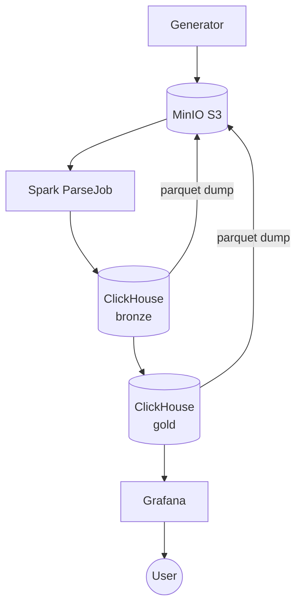

## Архитектура

## Процессы

### Джоба 1 (spark): парсинг сырых логов и формирование bronse

### Джоба 2 (СH): Агрегация gold

### Джоба 3 (СH): Бэкфилл паркетов

##  Cхема

### gold

### bronse

### Рантайм данных: окно расчетов и вотермарки

## Соответствие ТЗ

### Метрика 1

### Метрика 2
