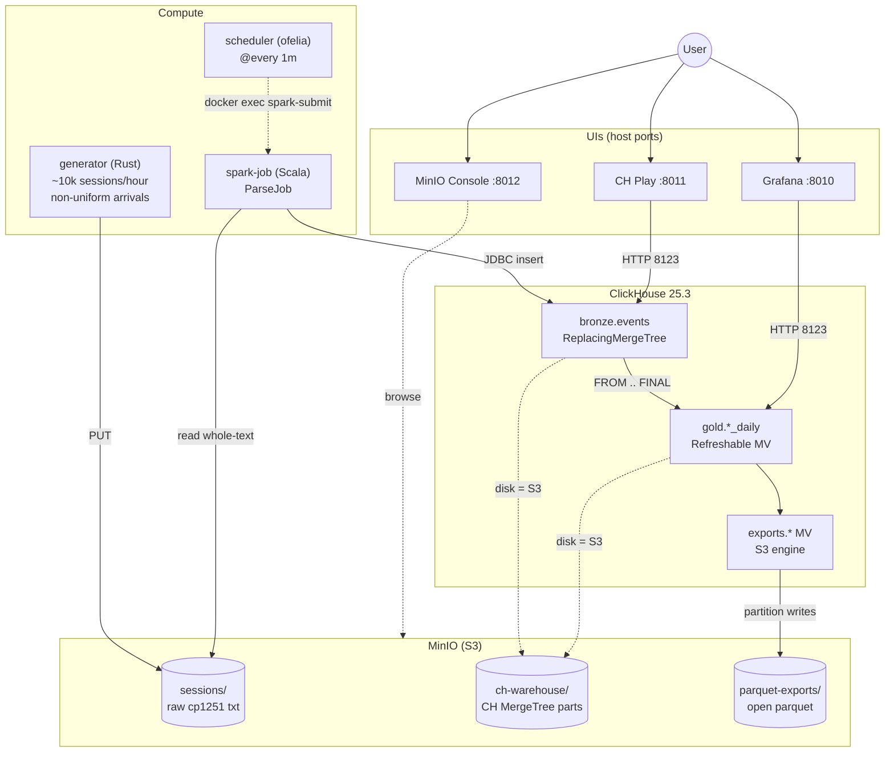

# Spark + ClickHouse + S3 — финальный проект

Полностью контейнеризованный pipeline аналитики сессий КонсультантПлюс.

- **Spark + Scala** парсит сырые логи и пишет в **ClickHouse** через JDBC
- **ClickHouse** хранит bronze/gold MergeTree-таблицы **физически на S3** (через S3 storage disk)
- **Refreshable Materialized Views** в CH считают целевые метрики автоматически — AggregateJob не нужен
- **Parquet exports** дублируют bronze/gold в открытом формате на S3 (escape-hatch от vendor lock)
- **Rust-генератор** подсыпает синтетические сессии в реальном времени
- **ofelia** запускает ParseJob каждую минуту
- Никаких сервисов на хосте — всё в `docker-compose`

Дизайн: [`docs/superpowers/specs/2026-05-23-spark-lakehouse-design.md`](docs/superpowers/specs/2026-05-23-spark-lakehouse-design.md)
План: [`docs/superpowers/plans/2026-05-23-spark-lakehouse-pipeline.md`](docs/superpowers/plans/2026-05-23-spark-lakehouse-pipeline.md)

## Архитектура



## Целевые метрики из `task.md`

1. **Количество карточных поисков, вернувших `ACC_45616`** — `gold.card_search_doc_hits_daily` в ClickHouse.
2. **Количество открытий каждого документа через быстрый поиск (QS) за каждый день** — `gold.qs_doc_opens_daily` в ClickHouse.

Эталонное значение для метрики 1 на исходных 10000 файлах: **479**.

## Требования

- Docker 24+ (тестировалось на colima на macOS aarch64)
- Compose v2 (`docker-compose` или `docker compose`)
- Свободные порты: **9000**, **9001**, **8123**, **9100**
- Ресурсы VM: **≥ 4 CPU / 8 GiB RAM** (Spark + JVM + CH одновременно)

  ```bash
  colima start --cpu 4 --memory 8 --disk 60
  ```

## Быстрый старт

```bash
cd final
docker-compose up -d --build
# первая сборка ~5-7 минут: maven build spark-jobs, rust build generator
# CH стартует через ~30 сек и применяет DDL из ./clickhouse/init/
```

После `up`:
- `mc-init` создаёт бакеты `sessions/`, `warehouse/`, `ch-warehouse/`, `parquet-exports/` и заливает 10000 файлов из `./data/` в `s3://sessions/`
- `clickhouse` поднимается, применяет DDL: `bronze.events`, `gold.*`, `exports.*`, 5 Refreshable MVs
- `generator` снимает распределения с 500 файлов и каждые 5 сек подсыпает синтетическую сессию
- `spark-job` стоит idle JVM
- `scheduler` (ofelia) каждую минуту вызывает `docker exec spark-job spark-submit ParseJob`

## Bootstrap

После `up` ParseJob запускается по cron автоматически (~через минуту). Чтобы дождаться первого полного прогона:

```bash
# подождать ~2 минуты — за это время:
# 1. cron-парсер прогнал 10k сессий в ch.bronze.events
# 2. Refreshable MV gold.* пересчитала метрики

sleep 120

# проверить bronze
docker-compose exec clickhouse clickhouse-client --user admin --password admin12345 \
  --query "SELECT count() FROM bronze.events FINAL"
# ожидается: ~135 000 (135k events from 10k sessions + ParseJob может ингестить дубли, FINAL дедупит)
```

## Чтение результатов

**Метрика 1** (карточные поиски, вернувшие `ACC_45616`):

```bash
docker-compose exec clickhouse clickhouse-client --user admin --password admin12345 --query "
SELECT sum(hits) AS total
FROM gold.card_search_doc_hits_daily
WHERE doc_id = 'ACC_45616'
  AND date < '2026-01-01'    -- фильтр исторических данных (отсекает синтетику от генератора)
"
```

Ожидается: **479**.

**Метрика 2** (top открытий через QS):

```bash
docker-compose exec clickhouse clickhouse-client --user admin --password admin12345 --query "
SELECT open_date, doc_id, opens
FROM gold.qs_doc_opens_daily
WHERE open_date < '2026-01-01'
ORDER BY opens DESC
LIMIT 50
"
```

Полный экспорт метрики 2 в CSV:

```bash
docker-compose exec clickhouse clickhouse-client --user admin --password admin12345 --query "
SELECT open_date, doc_id, opens
FROM gold.qs_doc_opens_daily
WHERE open_date < '2026-01-01'
ORDER BY open_date, opens DESC
FORMAT CSV
" > metric2.csv
```

## Где данные физически

| Слой | Формат | Физически |
|---|---|---|
| Сырые сессии | text (cp1251) | `s3://sessions/{0..9999, synthetic-*}` |
| **bronze** (типизированные события) | **CH MergeTree** | `s3://ch-warehouse/...` (CH-native binary) |
| **gold** (агрегированные метрики) | **CH MergeTree** | `s3://ch-warehouse/...` (CH-native binary) |
| Parquet snapshot bronze | open parquet | `s3://parquet-exports/bronze/` (refresh раз в час) |
| Parquet snapshot gold | open parquet | `s3://parquet-exports/gold/` (refresh раз в час) |
| CH metadata (schema, marks cache) | CH-internal | named volume `clickhouse-data` |

**Vendor lock:** bronze/gold в формате CH (читается только ClickHouse). Сырые сессии (`s3://sessions/`) и parquet-exports (`s3://parquet-exports/`) — открытые форматы, могут быть прочитаны любым движком.

## UI

| URL | Что |
|---|---|
| <http://localhost:9001> | MinIO Console (admin / admin12345) — посмотреть файлы в бакетах |
| <http://localhost:8123/play> | ClickHouse Play — встроенный SQL editor с pretty-таблицами |

ClickHouse Play — основной интерфейс для ad-hoc анализа. Пример:

```sql
-- Откройте http://localhost:8123/play, введите:
SELECT date, doc_id, hits
FROM gold.card_search_doc_hits_daily
WHERE doc_id = 'ACC_45616'
ORDER BY date
LIMIT 100
```

## Сервисы compose

| Сервис | Назначение |
|---|---|
| `minio` | S3-совместимое объектное хранилище для raw, ch-warehouse, parquet-exports |
| `mc-init` | One-shot: бакеты + загрузка 10k seed-файлов |
| `clickhouse` | ClickHouse 25.3, bronze+gold+exports на S3 disk |
| `spark-job` | Long-running idle JVM. ParseJob (Scala) запускается по cron через `docker exec` |
| `generator` | Rust-сервис, подсыпает синтетические сессии каждые 5 сек |
| `scheduler` | ofelia: parse `@every 1m` через flock (без overlap) |

## Структура проекта

```
final/
├── docker-compose.yml
├── .env                       # MinIO/CH/AWS credentials — single source of truth
├── data/                      # 10k seed файлов (исходники task.md)
├── docs/superpowers/{specs,plans}/   # дизайн + план
├── clickhouse/
│   ├── config.d/storage.xml   # S3 disk через from_env
│   ├── config.d/listen.xml    # listen_host = 0.0.0.0
│   └── init/01_schemas.sql    # bronze + gold + exports + 5 Refreshable MVs
├── scheduler/config.ini       # ofelia parse-cron + flock
├── generator/                 # Rust generator
└── spark-jobs/                # Scala application
    ├── pom.xml
    ├── Dockerfile             # multi-stage maven build → apache/spark + CH JDBC driver
    ├── conf/spark-defaults.conf
    └── src/main/scala/ru/consultant/lakehouse/
        ├── model/             # RawEvent, CardParam, EventType
        ├── parser/            # TimeParser, EventLineParser, SessionParser (pure Scala)
        └── jobs/              # SparkApp, ParseJob (JDBC write to CH)
```

## Известные тонкости

### 1. CH JDBC driver = `0.4.6-all` (не последний)

В Dockerfile отдельно скачивается `clickhouse-jdbc-0.4.6-all.jar` (self-contained, ~17 MB). Версии 0.6.x разбили `all` classifier — он перестал bundle'ить транзитивные deps (`com.clickhouse.client.*`, HttpClient5), это приводит к `NoClassDefFoundError`. 0.4.6 — последняя версия с реально self-contained `-all` jar.

### 2. Spark JDBC не поддерживает `ArrayType` для CH

Поля `card_params` и `result_doc_ids` (Array<String>) сериализуются в **JSON-строки** на стороне Spark (поля `card_params_json`, `result_doc_ids_json`). На стороне CH парсятся обратно через `JSONExtractArrayRaw` в MV. Это workaround для отсутствия CH Spark dialect — альтернатива была бы `clickhouse-spark-connector` от Altinity, но он добавляет существенную зависимость.

### 3. `ReplacingMergeTree(ingested_at)` для bronze + `FROM bronze.events FINAL` в MV

ParseJob не отслеживает обработанные файлы и пишет в bronze каждый запуск. Дубли по `(session_id, event_seq)` дедуплицирует `ReplacingMergeTree` в background. **MV читает с `FINAL`** — это форсит дедуп при чтении, поэтому даже до фоновой склейки cтабильно правильные числа.

### 4. CH listen_host

В дефолтной CH-конфигурации server слушает только `127.0.0.1` — другие контейнеры compose не могут подключиться. `clickhouse/config.d/listen.xml` ставит `<listen_host>0.0.0.0</listen_host>`.

### 5. `spark.sql.codegen.wholeStage=false`

В `spark-defaults.conf` отключён whole-stage codegen — на aarch64 (M-чипы через colima) Hotspot падает с SIGSEGV в `ConcurrentHashTable::get_node` при codegen-агрегациях. Без codegen стабильно. Для x86 проверки не критично, но не мешает.

### 6. Hot-window для метрик

Refresh MV каждую минуту делает **full recompute** по bronze. На нашем объёме (~135k rows) это миллисекунды. На больших объёмах стоит добавить partition pruning по `event_date >= today() - N` в SELECT.

### 7. Parquet exports: per-partition overwrite

CH S3 engine с `PARTITION BY toYYYYMMDD(event_date)` пишет per-day файлы. Каждый refresh exports MV перезаписывает файлы тех partition'ов, что изменились (overwrite by key). За счёт этого нет накопления старых снимков.

### 8. Vendor lock на bronze/gold — осознанный

CH MergeTree формат закрытый, читается только CH. Это компромисс: за это мы получаем killer-фичи (Refreshable MV для real-time agg, sub-second SQL queries) без необходимости в Iceberg/Delta + второго query engine. Escape hatch — `s3://parquet-exports/` (раз в час open snapshot).

Если CH-инстанс падает: данные в `s3://ch-warehouse/` остаются (CH формат, не open), но не читаемы без CH. Recovery — поднять CH с тем же volume `clickhouse-data` (хранит metadata) → таблицы доступны как и были. Если потерян `clickhouse-data` volume — нужен `ATTACH TABLE ... FROM ...` для каждой таблицы. Сырые сессии (`s3://sessions/`) и snapshot (`s3://parquet-exports/`) всегда переживут.

## Остановка / reset

```bash
docker-compose down              # остановить, оставить volumes
docker-compose down -v           # + удалить volumes (полный reset)
```
